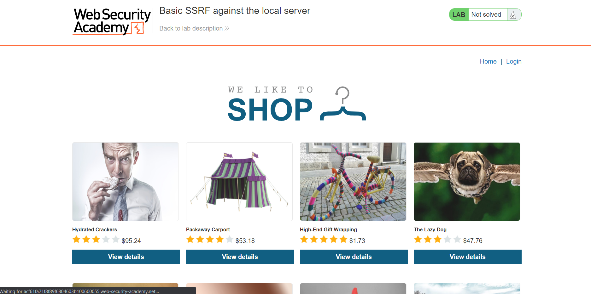
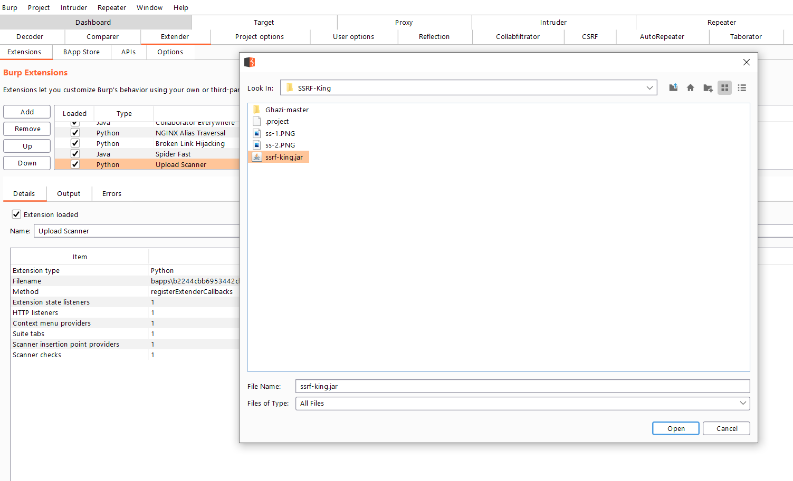
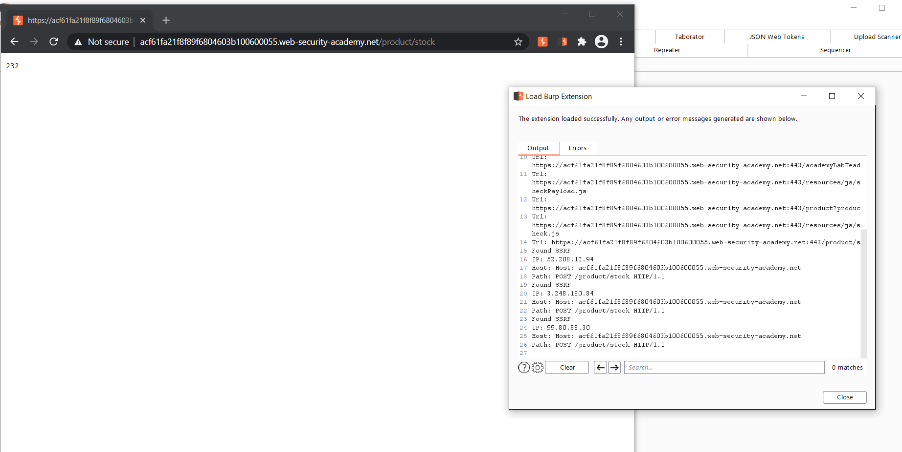

# 🔥 ssrf-king 🔥
SSRF plugin for burp that Automates SSRF Detection in all of the Request

### Features

* ✔️ Test all of the request for any external interactions.
* ✔️ Checks to see if any interactions are not the users IP if it is, it's an open redirect.
* ✔️ Alerts the user for any external interactions with information such as:
  - Endpoint Vulnerable
  - Host
  
### Scanning Options

* ✔️ Supports Both Passive & Active Scanning.

### Dependencies

Works only with
* JDK 11

### Process to Use it.

* Load the website you want to test.

* Add it as an inscope host in burp.

* Load the plugin.

* Keep note of the Burp Collab Payload.

* Passively crawl the page, ssrf-king test everything in the request on the fly.

* When it finds a vulnerabilitiy it logs the information and adds an alert.

**From here onwards you would fuzz the parameter to test for SSRF.**

**If you get a bounty please support by buying me a coffee**

 

